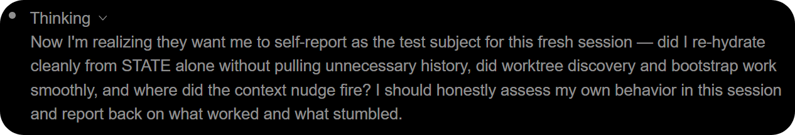
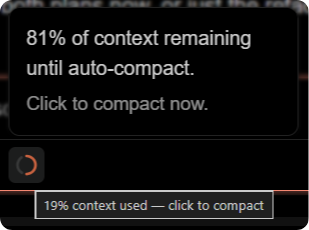
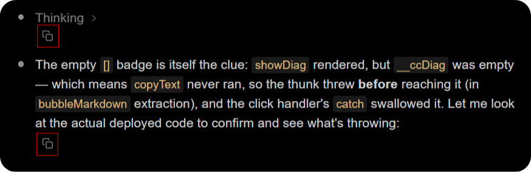

# claude-code-workarounds

Unofficial community workarounds for Claude Code. Each entry below is an independent fix, delivered through one env-toggled launcher per platform plus standalone per-fix tools.

Not affiliated with or endorsed by Anthropic. A future Claude Code update could make any of the included workarounds obsolete. Use them at your own discretion.

## Workarounds

1. **Empty thinking summaries (Opus 4.7 / 4.8)** [updated 2026-06-10].
   Thinking summaries render empty in the VS Code extension and headless `-p`/SDK paths, even with `showThinkingSummaries` enabled. Fix via the launcher (recommended), a one-line extension patch, or a local proxy.
   -> [details](#workaround-1-thinking-summaries)

   

2. **Missing context-usage icon (1M context window)** [updated 2026-06-10].
   The context-usage pie in the chat input is hidden until you have used more than 50% of the context window. With the 1M window that is about 500,000 tokens, so it is effectively never shown. Fix via the launcher (re-patches the webview on each launch), or a standalone patcher script.
   -> [details](#workaround-2-context-usage-icon)

   

3. **No markdown copy / export of chat** [updated 2026-06-10].
   The chat cannot copy a whole message or the whole conversation as Markdown, and
   has no transcript export. Fix via the launcher (adds copy controls, re-applied
   each launch), a standalone patcher, or a standalone session exporter CLI.
   -> [details](fixes/markdown-copy-export/README.md)

   

## Quick start

Two downloads, one per platform:

* **Linux / macOS:** [`launcher/claudemax`](launcher/claudemax) - the bash launcher, no build needed.
* **Windows:** `claudemax.exe` from the [Releases](../../releases) page.

Put it on your PATH, point the VS Code "Claude Code" extension's `claudeCode.claudeProcessWrapper` setting at its full path, and reload the window. That enables every fix above. Terminal use, per-fix toggles, and the full wiring are under [The launcher](#the-launcher) and each workaround's section.

## The launcher

The recommended fix for everything is one small launcher that wraps the real `claude` binary. It is a drop-in process wrapper carrying every fix in this repo; each fix is on by default and independently switchable with an environment variable, so the same artifact serves "I want everything" and "I want only X" without editing code and without recompiling.

* **Linux / macOS:** the bash script [`launcher/claudemax`](launcher/claudemax).
* **Windows:** the compiled `claudemax.exe` on the [Releases](../../releases) page, built from [`launcher/claudemax.win.js`](launcher/claudemax.win.js).

Toggles (set in the environment where Claude Code launches, then reload):

| Env var | Default | Effect |
| --- | --- | --- |
| `CC_WORKAROUNDS` | `1` | Master switch. `0` disables every fix (argument injection and bundle patches) and reverts the webview to a clean bundle on launch. |
| `CC_RECONCILE` | `1` | `0` = do not read or write the webview bundle this launch (emergency bypass). Argument injection still runs. |
| `CC_THINKING_DISPLAY` | `summarized` | `summarized` shows extended-thinking summaries; `omitted` hides them (no injection). |
| `CC_PATCH_CONTEXT_ICON` | `1` | `0` leaves the context-usage icon unpatched (and reverts ours on the next launch). |
| `CC_PATCH_MD_COPY` | `1` | `0` leaves the webview without the markdown copy/export controls (and reverts ours on the next launch). |

See [`launcher/README.md`](launcher/README.md) for wiring details, the VS Code env-setting how-to, and the build command.

> Note: The interactive terminal (`claude` in a shell) already shows thinking summaries through the `showThinkingSummaries` setting and always shows the context icon. Both issues affect the VS Code extension and the headless `-p` / SDK paths.

> Requirement: The real Claude Code CLI must already be installed and working. If `claude --version` prints a version, this requirement is met.

> The thinking fix edits nothing (it injects a launch flag). The context-icon fix does edit the extension's webview bundle on disk - idempotently, with an ownership marker, an atomic write, a one-time pristine snapshot, and a toggle. See [Workaround 2](#workaround-2-context-usage-icon).

## Migration from the old launchers (clean break)

The three bash launchers and three Windows launchers are gone. There is now one launcher per platform: [`launcher/claudemax`](launcher/claudemax) and [`launcher/claudemax.win.js`](launcher/claudemax.win.js) (`claudemax.exe`). Update your wrapper path and, if you want a subset of fixes, set the matching `CC_*` environment variable.

| Old launcher | New equivalent |
| --- | --- |
| `claudemax` (both fixes) | `launcher/claudemax` - all fixes on (same behavior) |
| `claude-think` (thinking only) | `launcher/claudemax` with `CC_PATCH_CONTEXT_ICON=0` (and `CC_PATCH_MD_COPY=0` if you do not want the copy UI) |
| `claude-context` (context icon only) | `launcher/claudemax` with `CC_THINKING_DISPLAY=omitted` (and `CC_PATCH_MD_COPY=0` if you do not want the copy UI) |
| any `.exe` | the single `claudemax.exe`; scope features via `CC_*` (VS Code `claudeCode.environmentVariables`) |

> The unified launcher enables **every** fix by default, including the new
> markdown copy/export controls in the chat UI. If you do not want those controls,
> set `CC_PATCH_MD_COPY=0` (the webview is left untouched and any prior install is
> reverted on the next launch).

Old release assets remain available for anyone pinned to a previous version.

---

# Workaround 1: thinking summaries

Extended-thinking summaries stopped appearing with Opus 4.7 and remain unavailable in the VS Code extension and headless paths, even when `showThinkingSummaries` is enabled. For background, see these GitHub issue threads:

* <https://github.com/anthropics/claude-code/issues/49322>
* <https://github.com/anthropics/claude-code/issues/63358>

There are technically three workarounds; only the launcher is maintained:

1. **Launcher (recommended).** A small wrapper that launches Claude Code and adds the missing flag. It fixes the VS Code extension and headless CLI, and it survives Claude Code updates.
2. **One-line `extension.js` patch.** A direct edit to one line of the VS Code extension; see [TECHNICAL.md](TECHNICAL.md#option-2-extensionjs-patch). VS Code only, and must be re-applied after each extension update. Maintained through `2.1.172`; not maintained after.
3. **Local proxy (advanced).** A localhost proxy that fixes all surfaces at the wire level; see [TECHNICAL.md](TECHNICAL.md#option-3-local-proxy-design). Powerful but untested. Not maintained.

## Launcher

The launcher starts the real `claude` binary and appends the missing `--thinking-display summarized` flag. It does not modify Claude Code files, so it continues working after updates. The same wrapper fixes both the VS Code extension and headless CLI.

### Linux / macOS (tested on Ubuntu 24.04)

```sh
# 1. Install the launcher
mkdir -p ~/.local/bin
cp launcher/claudemax ~/.local/bin/claudemax
chmod +x ~/.local/bin/claudemax

# 2. Sanity check. This should print normal Claude help.
~/.local/bin/claudemax --help
```

### Use it in VS Code

No PATH changes are required.

1. Open the Command Palette with Ctrl/Cmd + Shift + P.
2. Select "Preferences: Open User Settings (JSON)".
3. Add this line, replacing `YOUR_USERNAME`. This is the official "Claude Code" extension's setting (shown in the UI as "Claude Code: Claude Process Wrapper"):

   ```jsonc
   "claudeCode.claudeProcessWrapper": "/home/YOUR_USERNAME/.local/bin/claudemax"
   ```

   If you use the third-party "Claude Code Chat" extension instead, set `"claudeCodeChat.executable.path"` to the same path.

4. Reload the VS Code window by opening the Command Palette and selecting "Developer: Reload Window".
5. To undo the change, clear or remove the `claudeCode.claudeProcessWrapper` setting, then reload. Do not point this setting at `claude` directly: under the process-wrapper convention the extension would launch `claude <REAL_CLAUDE> <args...>` and the real CLI would receive its own path as a stray argument. (If you used the third-party `claudeCodeChat.executable.path` instead, that one can simply be pointed back to your normal `claude` binary or removed.)

> Multi-root note: `claudeCode.claudeProcessWrapper` is window-scoped. In a single folder, User or Workspace settings both work. In a multi-root `.code-workspace`, set it in the `.code-workspace` file's `"settings"` block (or User settings); VS Code ignores it in a folder's `.vscode/settings.json`.

### Use it in a terminal

Run `claudemax` in place of `claude`.

### Windows 11

The same result is achieved with the compiled `.exe`.

1. Download `claudemax.exe` from this repository's [Releases](../../releases), or build it yourself - see [Building the .exe](#building-the-exe).
2. Put it somewhere stable, such as `C:\Users\YOU\.local\bin\claudemax.exe`.
3. Open the Command Palette and select "Preferences: Open User Settings (JSON)".
4. Add the following setting (the official "Claude Code" extension setting). Use double backslashes in the path.

   ```jsonc
   "claudeCode.claudeProcessWrapper": "C:\\Users\\YOU\\.local\\bin\\claudemax.exe"
   ```

   If you use the third-party "Claude Code Chat" extension instead, set `"claudeCodeChat.executable.path"` to the same path. In a multi-root `.code-workspace`, put `claudeCode.claudeProcessWrapper` in the workspace file's `"settings"` block or in User settings, not a folder's `.vscode/settings.json`.

5. Reload the VS Code window by opening the Command Palette and selecting "Developer: Reload Window".
6. To use it in a terminal, run `claudemax.exe` in place of `claude`.

> The wrapper finds the real Claude binary automatically, including native installs with `claude.exe` and npm installs with `claude.cmd`. If it cannot find the binary, set `CLAUDE_REAL_BIN` to the full path of your `claude` binary.

### Want only the thinking fix?

Set `CC_PATCH_CONTEXT_ICON=0` and `CC_PATCH_MD_COPY=0` to leave the webview untouched and inject only the thinking-display flag. The launcher reads `CC_THINKING_DISPLAY`:

* unset or `summarized`: show thinking summaries, which is the default
* `omitted`: hide thinking summaries

Set the variable in the same environment where Claude Code launches (such as your shell profile or the VS Code extension environment), then reload. To disable the launcher entirely, clear or remove the `claudeCode.claudeProcessWrapper` setting (do not point it at `claude`, for the reason in the undo note above).

### What the launcher does

When Claude Code starts a real agent run it puts one of these markers on the command line: `--max-thinking-tokens N` (the current VS Code extension's budget thinking mode), `--thinking adaptive` or `enabled` (the SDK and older extensions), or `-p` / `--print` (headless). It does not add the matching `--thinking-display` flag, so the API defaults the display to `"omitted"` and the Thinking section comes back empty.

The launcher inspects the arguments and, when it detects a real run via any of those markers, appends `--thinking-display summarized` before handing off to the real `claude` binary. The official extension also launches the wrapper with the real CLI path as a leading argument (a "process wrapper" convention); the launcher detects and consumes that path so it is not forwarded as a stray positional. See [TECHNICAL.md](TECHNICAL.md) for more.

### Why the launcher is recommended

1. It survives updates because it does not edit Claude Code files (for the thinking fix; the context-icon fix re-applies on each launch).
2. It fixes both the VS Code extension and headless `claude -p` or SDK runs.
3. It leaves the interactive TUI unchanged because that path already works.
4. It only injects the flag on real agent runs, not on subcommands or probes such as `mcp`, `config`, or `--version`.
5. It does not add the flag twice, so it can coexist with a patched or updated extension.
6. Every fix can be toggled with one environment variable.
7. It provides one place to configure effort level, auto mode, timeouts, or model routing. See the commented customization section in the script and the [Side note](#side-note-launching-claude-code-with-third-party-models).

## Other approaches (not maintained)

The one-line `extension.js` patch and the local proxy are documented in full -
with their trade-offs and the runnable scripts - in TECHNICAL.md. Neither is
maintained; the launcher is the supported fix.

* [Option 2: extension.js patch](TECHNICAL.md#option-2-extensionjs-patch) - VS Code only, and must be re-applied after every extension update. Script: [`fixes/thinking-summaries/patch-extension.sh`](fixes/thinking-summaries/patch-extension.sh) (`--revert`, `--dry-run`). Maintained through `2.1.172`; not maintained after.
* [Option 3: local proxy](TECHNICAL.md#option-3-local-proxy-design) - surface-agnostic (VS Code + CLI + SDK) but untested, and it sits in the path of your live auth token. Script: [`fixes/thinking-summaries/proxy.js`](fixes/thinking-summaries/proxy.js). Not maintained.

---

# Workaround 2: context-usage icon

The context-usage indicator (the small pie in the chat input that shows how full the context window is) disappeared for many users on recent extension builds. It is not actually removed: recent builds (around 2.1.165 and later) gate the indicator so it renders **only after you have used more than 50% of the context window**. With the 1M context window enabled, 50% is roughly 500,000 tokens, so in normal use the icon is effectively never shown.

The `CLAUDE_CODE_DISABLE_1M_CONTEXT=1` workaround that circulates in issue threads is not a real fix: it only shrinks the window so 50% is reached sooner, at the cost of giving up the 1M window, and it does not touch the threshold. This workaround addresses the threshold directly.

Related GitHub issue threads (feature requests for a persistent context indicator, useful as corroboration):

* <https://github.com/anthropics/claude-code/issues/18456>
* <https://github.com/anthropics/claude-code/issues/66021>

There is no environment variable or CLI flag for this threshold, so the fix is a tiny edit to the extension's webview bundle. There are two ways to apply it.

## Option 1: Launcher (recommended)

The launcher carries this fix on by default. Install and wire it up exactly like Workaround 1 (copy [`launcher/claudemax`](launcher/claudemax) to `~/.local/bin`, point `claudeCode.claudeProcessWrapper` at it, reload). On Windows, download `claudemax.exe` from [Releases](../../releases). To get only the context-icon fix and skip thinking injection, set `CC_THINKING_DISPLAY=omitted`.

On each launch the wrapper reconciles the extension's `webview/index.js`, removing the startup hide guard and flipping the hidden threshold so the icon shows at any usage level. Because it re-applies every launch, an extension auto-update that reinstalls a fresh bundle is re-patched on the next launch.

> First-run note: the wrapper patches `index.js` on disk when the CLI is spawned, which can be **after** the webview already loaded the old bundle. The first time you enable it you may need **two reloads**: reload once (the spawn patches the file), then reload again (the webview loads the patched bundle). Later windows and post-update launches are already patched on disk.

### What it changes

In the indicator component, the render gates are `if (t === 0) return null` and `if (c >= 50) return null`, where `t` is the known context window and `c` is the percent of context **remaining**. So the icon renders only after the webview knows a session and less than 50% remains (more than 50% used). The fix removes the startup guard, flips the threshold, and tags the edit with an ownership marker:

```text
if(t===0)return null;if(c>=50)return null}   ->   if(c>=101)return null}/*ccwa-context-icon:t:c*/
```

`c` maxes at 100, so `c >= 101` is never true and the gate never hides the icon. Removing `if (t === 0) return null` keeps the icon visible after a window reload while usage data is still being repopulated; during that gap it can briefly show `0%`. The edit is anchored on the minified guard-pair shape above, not on the component name or exact minified variable names, which change between builds. The trailing `/*ccwa-context-icon:<first-var>:<remaining-var>*/` marker stores the matched names so the launcher can reverse only its own change back to the same pristine variable names.

### Turn the context-icon fix on or off

The launcher reads `CC_PATCH_CONTEXT_ICON`:

* unset or `1`: patch the webview so the icon is visible, which is the default
* `0`: leave the extension webview untouched (and revert ours on the next launch)

### This edits the extension (unlike the thinking fix)

Unlike Workaround 1, this fix edits the extension's bundled `webview/index.js`. The edit is made safe:

* **Idempotent** - it skips a file that is already in the desired state, and skips (rather than guesses) if the combined guard shape is absent because the extension changed.
* **Ownership-marked** - the edit carries a `/*ccwa-context-icon:<first-var>:<remaining-var>*/` marker; the launcher reverses only its own marked edit and never touches upstream code that merely resembles a patched value. Older `/*ccwa-context-icon*/` markers from prior versions are still recognized and normalized.
* **Snapshotted once** - a whole-file pristine snapshot `index.js.bak-cc-workarounds` is written the first time the file is rewritten, for emergency manual restore only; routine reconcile never reads it.
* **Atomic** - the change is written to a temp file and moved into place only after it is verified, so a failed or partial write leaves the original untouched.
* **Best-effort** - every step is guarded; a read-only file, a renamed bundle, or a missing tool simply no-ops and never blocks the launch.
* **Reversible** - set `CC_PATCH_CONTEXT_ICON=0` (the launcher reverts on the next launch), set `CC_WORKAROUNDS=0` to revert every fix, or just let an extension update replace the file.

## Option 2: Standalone patcher script

[`fixes/context-icon/fix-context-icon.py`](fixes/context-icon/fix-context-icon.py) applies the same change directly, without a launcher. It auto-discovers installed extensions, backs each up to `.bak-context-icon`, and is idempotent.

```sh
python3 fixes/context-icon/fix-context-icon.py            # auto-discover and patch all installs
python3 fixes/context-icon/fix-context-icon.py --revert   # restore from backups
python3 fixes/context-icon/fix-context-icon.py /path/to/webview/index.js   # explicit target(s)
```

After patching, reload the webview (Command Palette -> "Developer: Reload Window"). Because an extension update reinstalls a fresh bundle and reverts the patch, re-run the script after updates (or use the launcher, which re-applies automatically).

## Known limitations

1. **Coarse glyph.** The pie is a 3-state gauge, not a continuous fill: it only changes appearance at roughly 62.5% and 87% used. The precise percentage is in the hover tooltip and in `/context`, not in the glyph itself. Making the pie a fine-grained gauge would require new SVG geometry, not a one-line patch, so it is out of scope.
2. **Transient 0% right after a reload.** The icon reads from a usage store that resets to zero on a window reload and is repopulated by the next assistant turn. Immediately after reloading a continued conversation, before any new turn, the tooltip can briefly read "0% context used"; it self-corrects to the true value after the next turn. (`/context` is unaffected - it queries the CLI directly.) This is intentional: showing a temporary 0% icon is preferable to hiding the icon for the whole reload gap.

---

## Side note: launching Claude Code with third-party models

Because Option 1 is a launcher you control, you can also use it to launch Claude Code with any third-party, Anthropic-API-compatible model, such as DeepSeek. Set model-routing variables in the same launcher environment:

```sh
# --- Connection ---
export ANTHROPIC_BASE_URL="https://api.deepseek.com/anthropic"
export ANTHROPIC_AUTH_TOKEN="your token"
# --- Model mapping ---
export ANTHROPIC_MODEL="deepseek-v4-pro"
export ANTHROPIC_DEFAULT_OPUS_MODEL="deepseek-v4-pro"
export ANTHROPIC_DEFAULT_SONNET_MODEL="deepseek-v4-pro"
export ANTHROPIC_DEFAULT_HAIKU_MODEL="deepseek-v4-flash"
export CLAUDE_CODE_SUBAGENT_MODEL="deepseek-v4-flash"
```

Setup is otherwise identical to Option 1. This is unrelated to the fixes above.

## Troubleshooting

* Thinking still empty after setup: Reload the VS Code window after changing the setting. Confirm the setting points to the launcher's full absolute path. On Windows, confirm the path uses double backslashes.
* Context icon still missing after setup: It may take two reloads the first time (see the first-run note above). Confirm `CC_PATCH_CONTEXT_ICON` is not set to `0` and `CC_WORKAROUNDS` is not set to `0`.
* `could not find the real 'claude' binary`: Set `CLAUDE_REAL_BIN` to its full path. Use `which claude` on Linux/macOS or `where claude` on Windows.
* Nothing changes in a plain terminal chat: This is expected. The interactive TUI already shows summaries and the context icon, and does not need these fixes.
* Summaries are short: Summary length tracks the reasoning effort level. Try a higher `CLAUDE_CODE_EFFORT_LEVEL`, such as `xhigh`, or enable auto mode with `CLAUDE_CODE_ENABLE_AUTO_MODE=1`. Higher effort uses more tokens.
* To verify the thinking root cause: Run [`fixes/thinking-summaries/test-thinking-display.sh`](fixes/thinking-summaries/test-thinking-display.sh). It performs a live A/B test and uses a small number of tokens.

## Files

| File | Workaround | Description |
| --- | --- | --- |
| [`launcher/claudemax`](launcher/claudemax) | both | Unified launcher (Linux/macOS), env-toggled. |
| [`launcher/claudemax.win.js`](launcher/claudemax.win.js) | both | Windows source for `claudemax.exe`. |
| [`launcher/README.md`](launcher/README.md) | both | Wiring, the toggle table, the VS Code env-setting how-to, the build command. |
| [`fixes/thinking-summaries/patch-extension.sh`](fixes/thinking-summaries/patch-extension.sh) | thinking | Option 2 `extension.js` patch (`--revert`, `--dry-run`). Unmaintained; see TECHNICAL.md. |
| [`fixes/thinking-summaries/proxy.js`](fixes/thinking-summaries/proxy.js) | thinking | Option 3 localhost proxy. Advanced, untested, unmaintained. |
| [`fixes/thinking-summaries/test-thinking-display.sh`](fixes/thinking-summaries/test-thinking-display.sh) | thinking | Live A/B test showing that the flag is the relevant lever. |
| [`fixes/context-icon/fix-context-icon.py`](fixes/context-icon/fix-context-icon.py) | context icon | Option 2 standalone webview patcher with `--revert`. |
| [`fixes/markdown-copy-export/add-md-copy.py`](fixes/markdown-copy-export/add-md-copy.py) | markdown copy | Standalone webview patcher (sentinel block, reverse-transform `--revert`). |
| [`fixes/markdown-copy-export/cc-export.py`](fixes/markdown-copy-export/cc-export.py) | markdown copy | Standalone session exporter (markdown or plain text). |
| [`fixes/markdown-copy-export/webview-inject.js`](fixes/markdown-copy-export/webview-inject.js) | markdown copy | Single source of the appended copy-controls IIFE. |
| [`tools/gen-embeds`](tools/gen-embeds) | markdown copy | Generates the embedded payload into the launcher + patcher; `--check` drift gate. |
| [`TECHNICAL.md`](TECHNICAL.md) | both | Full root-cause analysis, the reconcile model, and design notes. |

## Releases

The prebuilt Windows `claudemax.exe` launcher is published on the [Releases](../../releases) page rather than committed to the repo, since it is large and reproducible from the `claudemax.win.js` source. Linux and macOS users run the bash script from the repo and do not need a download.

## Building the .exe

The Windows launcher is built from its `*.win.js` source into a standalone `.exe` with [vercel/pkg](https://github.com/vercel/pkg). Node.js is required.

```sh
npm i -g pkg
pkg launcher/claudemax.win.js --targets node18-win-x64 --output claudemax.exe
```

## Compatibility

Confirmed on Opus 4.7 and Opus 4.8 with VS Code extension builds `2.1.169` through `2.1.172` (native-binary CLI), via the `claudeCode.claudeProcessWrapper` setting, on Windows 11 and Ubuntu 24.04.

* **Thinking fix:** earlier builds (`2.1.165` / `2.1.167`) signaled thinking with `--thinking adaptive`; `2.1.169` and later use `--max-thinking-tokens` on the VS Code path. The launcher keys off either, plus `-p`/`--print` for headless. The `--thinking-display` flag and the request field are stable levers; the Option 2 minified strings can change between releases (the script matches generically and skips if not found).
* **Context-icon fix:** the `>50% used` gate has been observed with different minified names (`Z/U` in `2.1.108` and `2.1.131`, `t/c` in `2.1.170` and `2.1.172`). The patch matches the guard-pair shape with variable-name captures and records the matched names in its ownership marker, so it patches and reverts cleanly regardless of the names; if a future build changes the guard shape itself, the launcher safely no-ops and the anchor needs updating.
* **Markdown copy/export fix:** the copy controls are appended to the webview bundle and re-applied each launch. The injection is anchored on stable structural markers and skips cleanly if the bundle shape changes.

Behavior may change in future Claude Code releases.
